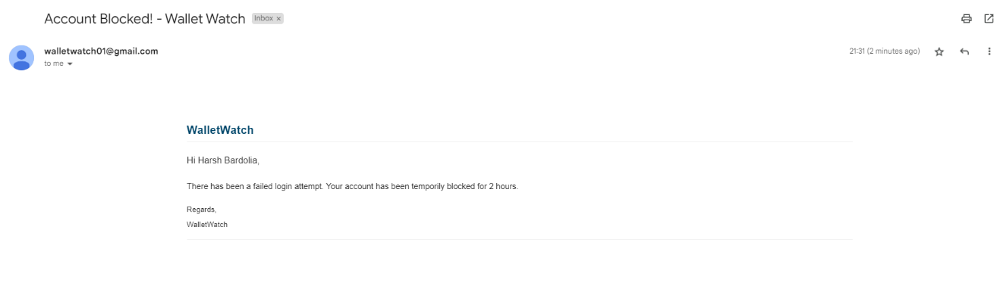

# WalletWatch

Deployment Link: http://wallet-watch-01.vercel.app/

## Table of Contents

-   [Project Description](#project-description)
-   [Objectives](#objectives)
-   [Features](#features)
-   [Technologies Used](#technologies-used)
-   [Environment Variables](#environment-variables)
-   [Run Locally](#run-locally)
-   [Tech Stack](#tech-stack)
-   [Screenshots](#screenshots)

## Project Description

> Wallet Watch is an OTP secured web based application designed to assist users in tracking and managing their daily transactions. The project establishes a highly secure authentication process that mitigates common vulnerabilities associated with traditional username-password combinations. This combination ensures a robust and scalable architecture capable of handling a growing user base.

## Objectives

> -   Provide a highly secure and user-friendly authentication mechanism for public networks.
> -   Offer a secure platform for users to track their daily transactions.

## Features

> #### User Authentication
>
> -   Email Verification using OTP while register and login.
> -   Reset password using OTP when the user forgets the password.
> -   Temporary Account Blocking incase of invalid login attempt.
> -   Notifying user about invalid login attempt via email.

> #### Transaction Dashboard
>
> -   Provide a visual dashboard displaying an overview of the user's transactions.
> -   Enable users to create, update or delete any transaction.
> -   Allow users to Logout

## Technologies Used

> #### Backend
>
> -   Utilized Node.js and Express.js to build REST APIs serving as the application's backend.
> -   Engineered a secure authentication system by using the Nodemailer library, ensuring the confidential and reliable delivery of One Time Password for user authentication.
> -   Conducted comprehensive testing using Postman for optimal performance.

> #### Frontend
>
> -   Leveraged Material-UI and DevExtreme to desgin a seamless user interface for enhanced user experience.
> -   Enhanced user convenience by eliminating repeated logins using Local Storage, maintaining persistent login session.

> #### Database
>
> -   Stored all data, including user information and transaction details in MongoDB, a NoSQL database.
> -   Utilized MongoDB Atlas, a cloud based database.

> #### Deployment
>
> -   Deployed the Backend for the application on Render.
> -   Deployed the Frontend for the application on Vercel.
> -   Set up Continuous Integration and Continuous Deployment (CI/CD) pipelines for automated builds and deployments.

## Environment Variables

To run this project, you will need to add the following environment variables to your `.env` file in backend folder create config folder and add `config.env` file in it and all env variables there.

#### Environment variables related to the email account used for sending OTPs and Notifications

If you are using gmail, enable 2 Step Verification

-   `MAIL_HOST` : Your email host, generally `smtp.gmail.com` for gmail.
-   `MAIL_USER` : Your email username
-   `MAIL_PASS` : Your email password, incase of gmail it is App Password in the 2 Step Verification of your account.

#### Server related environment variables

-   `MONGO_URL` : Your MongoDB connection string
-   `PORT` : Port number

## Run Locally

Clone the project

```bash
  git clone https://github.com/HarshBardolia01/WalletWatch.git
```

Go to the project directory

```bash
  cd WalletWatch
```

Go to the backend directory and Install dependencies

```bash
  cd backend
```

```bash
  npm install
```

Start the backend server

```bash
  npm run server
```

Go to the frontend directory and Install dependencies

```bash
  cd frontend
```

```bash
  npm install
```

Start the frontend server

```bash
  npm start
```

## Tech Stack

**Client:** React.js, Material-UI, DevExtreme

**Server:** Node.js, Express.js

**Database:** MongoDB Atlas

**Testing:** Postman

## Screenshots

### Registration

-   Send OTP

    

-   Email - Register OTP

    

-   Register - Set Password

    

### Login

-   Enter Credentials

    

-   Email - Login OTP

    

-   Login OTP

    

### Reset Password

-   Enter Email & OTP

    

-   Email - Reset Password OTP

    

### Block Unauthorized Access

-   OTP sent

    

-   Incorrect OTP Entered

    

-   Email Alert to Account Holder

    

-   Further Login Attempts Blocked

    

### HomePage

-   Home Page - No transactions

    

-   Home Page - Transaction

    

-   Add / Update Transaction

    

-   Delete Transaction

    

## Contribution

Contributions are welcome! If you find any bugs or want to enhance the app, feel free to open issues or submit pull requests. Please make sure to follow the coding standards and guidelines.

Happy coding! If you have any questions or need assistance, don't hesitate to reach out.

## Designed and Implemented By

### Harsh Bardolia

-   [Github](https://github.com/HarshBardolia01)
-   [LinkedIn](https://www.linkedin.com/in/harsh-bardolia-0a0407217/)

### Khushali Vaidya

-   [Github](https://github.com/khushalivaidya)
-   [LinkedIn](https://www.linkedin.com/in/khushalivaidya/)
